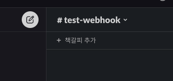
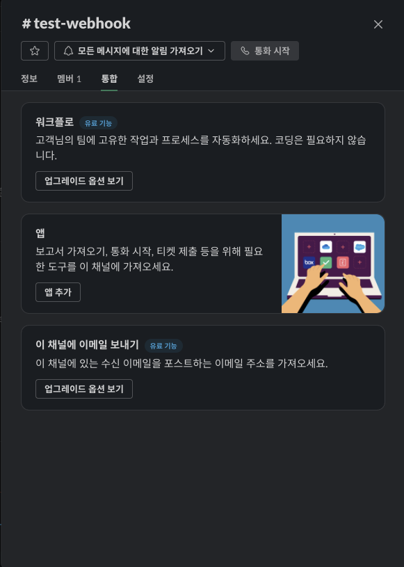

# NestJS 에서 Slack 으로 메시지 보내기

### 슬랙 워크스페이스 채널에 웹훅 앱 추가

슬랙을 다운받고 워크스페이스의 채널에 웹훅 앱을 추가해야 한다.

 

 

채널명을 클릭하고 통합을 누르면 앱에 앱 추가 버튼을 눌러서 incoming-webhook을 추가한다.

 

추가하면서 받게되는 웹훅 URL을 잘 저장해두고, 원하는 채널 및 기타 설정을 통해 웹훅 앱 추가를 마친다. 추가가 끝나게 되면 이런 메시지를 받게 된다.

 

### NestJS에 Slack 세팅

<참고>

https://jojoldu.tistory.com/552

https://github.com/g59/nestjs-plugins

https://velog.io/@1yongs_/NestJS-TDD-입고-알림-3.-Slack-Webhook-연동