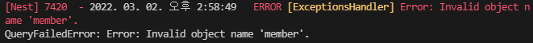

# Entity 클래스명이 쿼리문 변환시 소문자 되는 문제

NestJS + TypeORM + MSSQL 환경에서 Entity 클래스와 DB 테이블의 매핑에서 문제가 되는 부분이 발생했다.

Entity의 클래스명이 쿼리문으로 변경되면 소문자로 바뀌는 문제다.

<br>

DB 테이블명

- Member

Entity의 클래스명

- Member

<br>

Member 클래스가 쿼리문으로 바뀌면서 member로 변환됐다.



<br>

만약에 Entity 클래스명이 UserAccount 클래스라고 한다면 user_account로 변경됐다.

<br>

이는 간단하게 해결할 수 있었다.

@Entity() 데코레이터에 테이블명을 입력해주면 된다.

```tsx
@Entity('Member')
export class Member {
    
}
```

<br>

<참고>

https://github.com/typeorm/typeorm/issues/2174

https://github.com/typeorm/typeorm/issues/1163